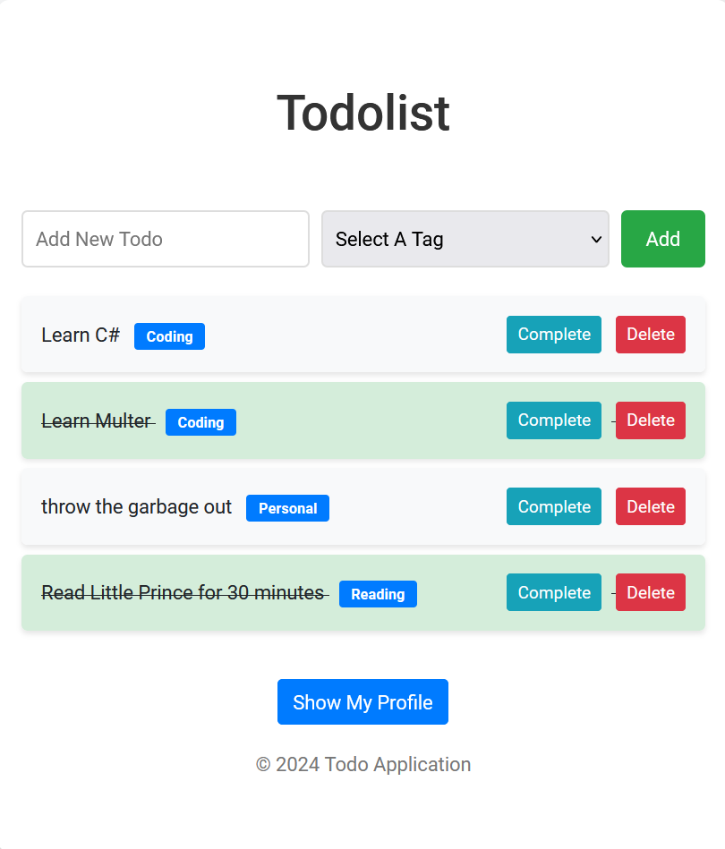

Todo Application by Express-Typescript-EJS-Mongoose
==================================

<b>This is a todo application made with Express, Typescript, Mongoose and EJS.</b>

Features
-------
- The App includes [Multer](https://github.com/expressjs/multer?tab=readme-ov-file) library, which allows the user to store an image.
- User can organize and analyse his todos according to the tags.
- User can create and delete the tag that he wants.
- The frontend was created by ChatGpt :)


``` sh
# clone it
git clone https://github.com/pysk0101/Blog-App.git
cd Todo-App

# Make it your own
rm -rf .git && git init && npm init

# Install Dependencies (copy them)
npm install bcrypt@^5.1.1 cookie-parser@^1.4.6 cors@^2.8.5 dotenv@^16.4.5 ejs@^3.1.10 express@^4.19.2 fs@^0.0.1-security jsonwebtoken@^9.0.2 mongoose@^8.4.4 multer@^1.4.5-lts.1 nodemon@^3.1.4 ts-node@^10.9.2 typescript@^5.5.2

# Install Dev Dependencies (copy them)
npm install --save-dev @types/bcrypt@^5.0.2 @types/cookie-parser@^1.4.7 @types/express@^4.17.21 @types/jsonwebtoken@^9.0.6 @types/mongoose@^5.11.97 @types/multer@^1.4.11


### Explanation:

- Dependencies: These are the core packages needed for your application to run.
- Dev Dependencies: These are packages needed only during development, such as TypeScript type definitions.

You can now use this updated README file to guide users on how to install the necessary dependencies for your project.


# Run the App
cd src
nodemon server.ts

```

Some Pictures from The App
------
<br>


